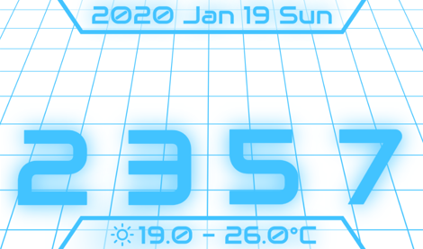
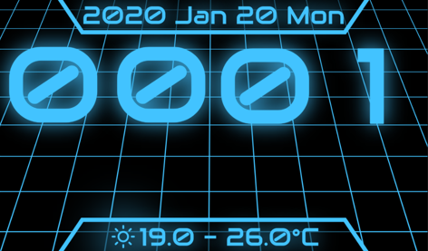

# Slow Techno Clock

Welcome to Slow Techno Clock!

This clock comes with light theme and dark theme

 

## Run this clock

Following are the steps to run the clock

1. clone the repo
2. use shell and chang working directory to `slow_techno_clock`, e.g. `cd ./slow_techno_clock`
3. `flutter create .`
4. `flutter run`
